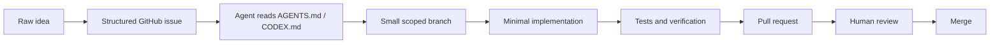
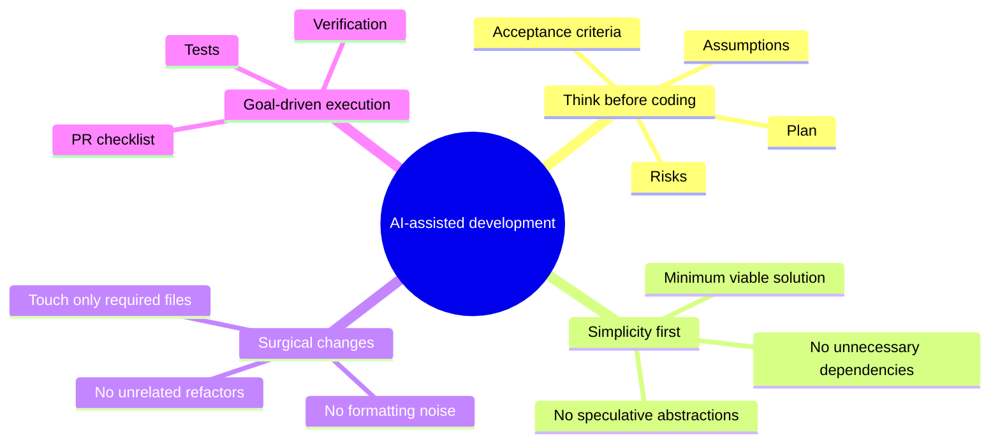
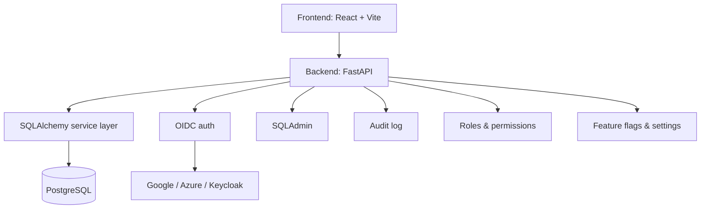
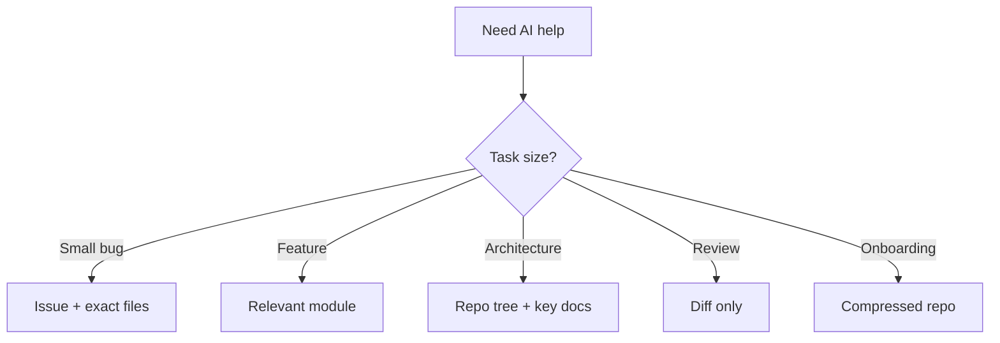
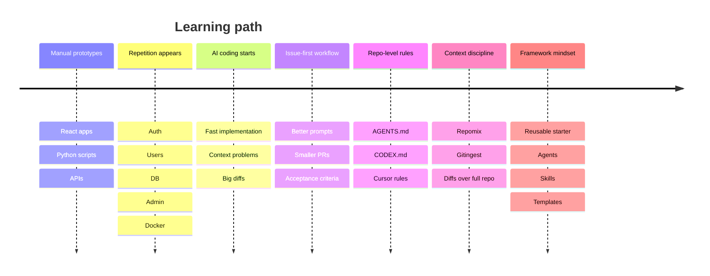

# Developer Framework — Ander Fernández

<p align="center">
  
  
  
  
  
</p>

<p align="center">
  <b>A practical operating system for building software with AI agents, reusable architecture, token discipline and small verifiable pull requests.</b>
</p>

<p align="center">
  <a href="#the-core-workflow">Workflow</a> ·
  <a href="#my-stack">Stack</a> ·
  <a href="#agents">Agents</a> ·
  <a href="#skills">Skills</a> ·
  <a href="#token-optimization">Token Optimization</a> ·
  <a href="#learning-process">Learning Process</a>
</p>

---

## What is this?

This repository explains how I build software with a mix of product thinking, data/AI background, backend/frontend development and AI-assisted coding tools.

It is not a theoretical framework.

It is the result of iterating through real projects:

- Basketball analytics platforms.
- OCR and invoice extraction systems.
- Transcription and diarization tools.
- WhatsApp automation prototypes.
- Internal dashboards.
- SaaS-style apps.
- Dockerized VPS services.
- Authenticated admin panels.
- AI-assisted development workflows.

The purpose is simple:

> Build faster without losing control of the codebase.

---

## Why I built this

When you build several projects in parallel, the same foundations appear again and again:

| Repeated need | Typical problem |
|---|---|
| Authentication | Rebuilding login every time |
| Users and permissions | Repeating role logic |
| Admin panel | Creating backoffice screens from scratch |
| Database | Repeating SQLAlchemy/Alembic setup |
| Docker | Reinventing local/dev deployment |
| AI agents | Giving the same instructions over and over |
| Context | Burning tokens with full-repo prompts |
| Issues | Asking AI for code before defining the task |

This repo turns that repetition into a system.

---

## The core workflow



The important shift:

```diff
- Ask AI to build random things from vague prompts
+ Give agents scoped issues, rules, context and acceptance criteria
```

---

## My operating principles



### 1. Think before coding

Before implementation, the agent must state:

- Objective understood.
- Assumptions.
- Risks.
- Minimal plan.
- Files to touch.
- Acceptance criteria.

### 2. Simplicity first

The best implementation is usually the smallest one that solves the current issue.

### 3. Surgical changes

Every changed line should map back to the issue.

### 4. Goal-driven execution

No vague “make it work”. Every task needs verifiable success criteria.

---

## My stack

### Product / engineering profile

I work at the intersection of:

```text
Product thinking
        +
Data / AI
        +
Backend engineering
        +
Frontend delivery
        +
Automation / self-hosting
```

### Preferred technical stack

| Layer | Default choice |
|---|---|
| Backend | FastAPI |
| ORM | SQLAlchemy 2.x |
| Migrations | Alembic |
| Database | PostgreSQL |
| Frontend | React + Vite + TypeScript |
| UI | Tailwind CSS + shadcn/ui |
| Server state | TanStack Query |
| Forms | React Hook Form + Zod |
| Auth | OIDC |
| Providers | Azure Entra ID, Google, Keycloak |
| Admin | SQLAdmin first |
| Infra | Docker Compose |
| Deploy | VPS / reverse proxy / Cloudflare when useful |
| AI context | Repomix / Gitingest |
| Work units | GitHub Issues + Pull Requests |

---

## Reusable app starter

Most apps I build need the same base:



Core models:

```text
User
ExternalIdentity
Organization
Membership
Role
Permission
RolePermission
UserRole
AppProject
AppSetting
FeatureFlag
AuditLog
```

This prevents rebuilding the same authentication, database and admin foundations in every project.

---

## Agents

The `agents/` folder contains operational profiles.

They are not magic bots by themselves. They are role definitions that Codex, Cursor, Claude Code or another coding assistant can be asked to follow.

| Agent | Mission |
|---|---|
| `architect` | Define the smallest viable technical approach |
| `backend` | Implement FastAPI, SQLAlchemy, services and tests |
| `frontend` | Implement React, routes, forms and UI states |
| `auth` | Handle OIDC, sessions, users and permissions |
| `database` | Models, migrations, seeds and constraints |
| `admin` | SQLAdmin/backoffice functionality |
| `qa` | Reproduction, tests and verification |
| `devops` | Docker, env vars, deployment and healthchecks |

Example prompt:

```md
Read AGENTS.md and agents/backend.md.

Act as the backend agent.

Implement issue #12 with surgical changes.
Before coding, return objective, assumptions, plan, files to touch and acceptance criteria.
```

---

## Skills

The `skills/` folder contains reusable task recipes.

| Skill | Use when |
|---|---|
| `create-feature` | Building an end-to-end feature |
| `create-crud-module` | Adding a model + API + admin view |
| `add-oidc-provider` | Adding Google, Azure, Keycloak or another provider |
| `add-admin-view` | Exposing a model in SQLAdmin |
| `debug-bug` | Fixing a reproducible bug |
| `review-pr` | Reviewing an AI-generated PR |
| `prepare-deploy` | Preparing Docker/VPS deployment |

Example prompt:

```md
Read AGENTS.md and skills/create-crud-module.md.

Create a CRUD module for `Customer`.

Acceptance criteria:
- SQLAlchemy model.
- Alembic migration.
- Pydantic schemas.
- Repository.
- Service.
- Router.
- SQLAdmin view.
- Tests.
```

---

## Token optimization

The rule:

> Never send the full repo if a module or diff is enough.



Recommended context levels:

| Level | Context | Use case |
|---|---|---|
| 0 | Issue + exact files | Small bugs |
| 1 | Repo tree + relevant files | Normal feature |
| 2 | Full module | Medium feature |
| 3 | Compressed repo | Architecture review |
| 4 | Full repo | Last resort |

Useful commands:

```bash
npx repomix@latest --compress
npx repomix@latest --token-count-tree 100
npx repomix@latest --include-diffs
npx repomix@latest --include "backend/app/**/*.py,frontend/src/**/*.tsx"
```

---

## Issue-first development

A good issue is the interface between product thinking and AI execution.

### Feature issue

```md
## Objective

## Context

## What not to touch

## Backend changes

## Frontend changes

## Database changes

## Permissions

## Acceptance criteria

- [ ]

## Verification

- [ ] Backend tests
- [ ] Frontend build
- [ ] Migrations
- [ ] Manual test
```

### Bug issue

```md
## Symptom

## Steps to reproduce

## Expected result

## Actual result

## Logs

## What not to touch

## Acceptance criteria

- [ ] Bug reproduced
- [ ] Root cause explained
- [ ] Minimal fix applied
- [ ] Test added or justification provided
```

---

## Learning process

This methodology came from building, breaking, debugging and repeating.



The biggest learning:

> AI does not remove the need for engineering judgment. It increases the value of clear specs, constraints and verification.

---

## Repository map

```text
.
├── AGENTS.md
├── CODEX.md
├── repomix.config.json
├── docs/
│   ├── AI_DEV_OPERATING_SYSTEM.md
│   ├── app-starter-framework.md
│   ├── workflow.md
│   ├── stack.md
│   ├── learning-process.md
│   └── token-optimization.md
├── agents/
├── skills/
├── templates/
├── .github/
└── .cursor/
```

---

## How to use this framework

### In a new project

1. Copy `AGENTS.md`.
2. Copy `CODEX.md`.
3. Copy `repomix.config.json`.
4. Copy `.github/` templates.
5. Add project-specific rules.
6. Work through issues.

### In an existing project

1. Add `AGENTS.md`.
2. Add a short project-specific `CODEX.md`.
3. Add issue/PR templates.
4. Add Repomix config.
5. Start enforcing small PRs.

### With Codex

```md
Read AGENTS.md and CODEX.md.

Implement the current issue.

Before coding:
1. Objective understood.
2. Assumptions.
3. Risks.
4. Minimal plan.
5. Files to touch.
6. Acceptance criteria.

After coding:
1. Summary.
2. Verification.
3. Risks.
4. What was not tested.
```

---

## What this is not

This is not:

- A replacement for senior review.
- A magic agent framework.
- A full enterprise architecture.
- A reason to skip tests.
- A collection of prompts without process.

It is a practical way to make AI-assisted development repeatable.

---

## Author

**Ander Fernández**  
Technical Product / Data / AI / Software Builder

GitHub: `@mazapander`

---

<p align="center">
  <b>Build fast. Keep control. Make the work reviewable.</b>
</p>
